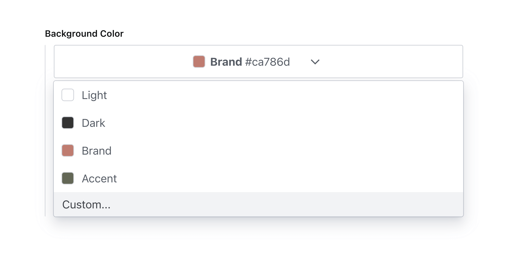
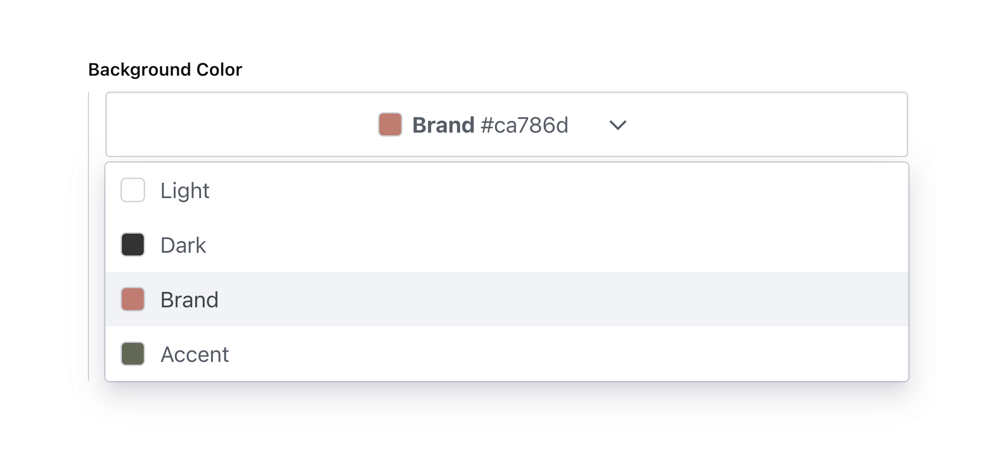
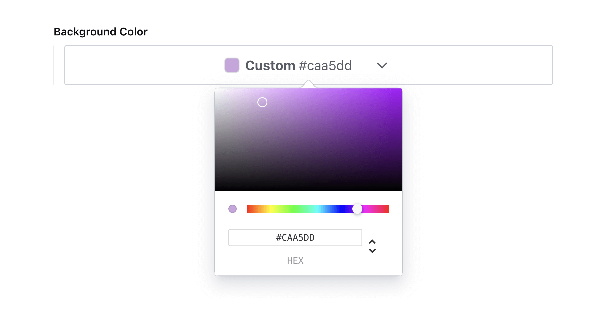

<div align="center">
<h1>
  Simpler Color Input 🎨
</h1>
  <p>A simpler color input for Sanity studio.</p>
      <p>Created by <a href="https://github.com/AlyssaKirstine">@AlyssaKirstine</a></p>
  </div>




## 🤩 Features

✓ Sanity v3 support

✓ Select a custom color using a color picker or HEX values

✓ Select a color from a predefined theme

✓ Dark mode support

## 🔌 Install

> This is a **Sanity Studio v3** plugin.

```sh
npm install sanity-plugin-simpler-color-input
```

or

```sh
yarn add sanity-plugin-simpler-color-input
```

## 💡 How to Use

Add it as a plugin in `sanity.config.ts` (or .js):

```ts
import { defineConfig } from 'sanity'
import { simplerColorInput } from 'sanity-plugin-simpler-color-input'

export default defineConfig({
  //...
  plugins: [
    simplerColorInput()
  ],
})
```

Now you can use the `simplerColor` type in your schema types:

```js
// [...]
{
  fields: [
    // [...]
    {
      name: 'backgroundColor',
      title: 'Background color',
      type: 'simplerColor',
    },
  ]
}
```

## ⚙️ Options

### Color list

To add list of predefined selectable color swatches for the user to choose from use `colorList`.

```js
// ...fields...
{
  name: 'backgroundColor',
  title: 'Background Color with List',
  type: 'simplerColor',
  options: {
    colorList: [
      { label: 'Light', value: '#ffffff' },
      { label: 'Dark', value: '#333333' },
      { label: 'Brand', value: '#ca786d' },
      { label: 'Accent', value: '#626754' },
    ]
  }
}
```

Which will render accordingly:



### Allow Custom Values

To allow custom color values, set `allowCustomValue` to `true`:

```js
// ...fields...
{
  name: 'backgroundColor',
  title: 'Background Color no-alpha',
  type: 'simplerColor',
  options: {
    colorList: [
      { label: 'Light', value: '#ffffff' },
      { label: 'Dark', value: '#333333' },
      { label: 'Brand', value: '#ca786d' },
      { label: 'Accent', value: '#626754' },
    ],
    allowCustomValue: true
  }
}
```

Which will render accordingly:



**Note:** custom color values will automatically be enabled if no color list is specified.

## 📚 Data model

```js
{
  _type: 'simplerColor',
  label: 'Brand',
  value: '#ca786d',
}
```

## 💜 License

Created by [@AlyssaKirstine](https://github.com/AlyssaKirstine)

[MIT](LICENSE) © Cosite LLC

## 🧪 Develop & test

This plugin uses [@sanity/plugin-kit](https://github.com/sanity-io/plugin-kit)
with default configuration for build & watch scripts.

See [Testing a plugin in Sanity Studio](https://github.com/sanity-io/plugin-kit#testing-a-plugin-in-sanity-studio)
on how to run this plugin with hotreload in the studio.


### Release new version

Run ["CI & Release" workflow](https://github.com/cositehq/sanity-plugin-simpler-color-input/actions/workflows/main.yml).
Make sure to select the main branch and check "Release new version".

Semantic release will only release on configured branches, so it is safe to run release on any branch.